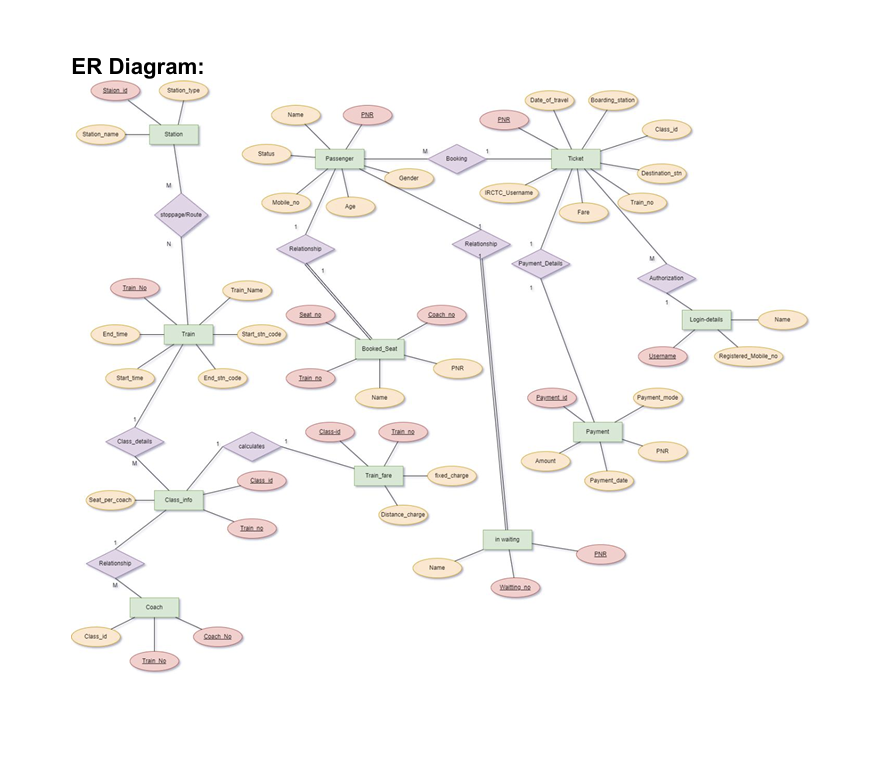
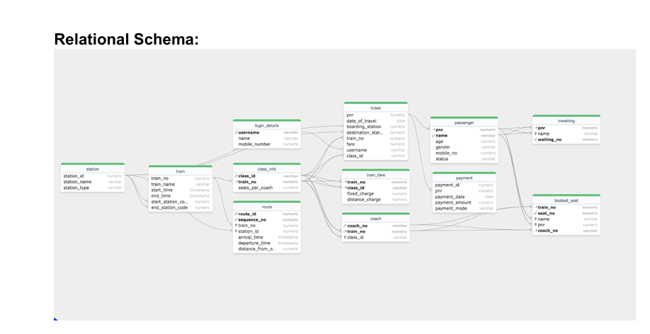

# Railway Reservation System Database

## Project Overview
This project aims to create a structured system for the reservation of tickets for any journey based on the availability of tickets. It provides information about particular trains and stations.

## Introduction
The Railway Reservation System database project focuses on designing and implementing a database schema to manage the reservation of train tickets. Unlike a Database Management System (DBMS), which includes software for managing databases, this project emphasizes the database schema itself.

## Objectives
- **Design a normalized schema** for storing train schedules, routes, tickets, and passenger information.
- **Ensure proper relationships and constraints** to maintain data integrity.
- **Define tables, columns, primary and foreign keys**, and establish relationships between entities.
- **Populate the database with sample data** to demonstrate its functionality.

## Scope
- **Train Information**: Storing details about trains, including train number, train name, route, different classes, number of seats, time of arrival, and fare calculations.
- **Passenger Information**: Storing passenger details such as name, age, mobile number, PNR details, seat information, and more.
- **Payment Integration and Security**: Integrating payment gateways to facilitate secure online transactions.
- **Seat Reservation**: Allowing users to reserve seats on selected trains and classes based on availability.

## Functionalities
- **Creation of Tables**: Defining tables for trains, stations, tickets, and seats along with their attributes.
- **Train Search and Booking**: Providing search functionality for users to find trains based on source, destination, and date of travel. Enabling users to select their preferred train, class, and seats, and proceed with the booking process.
- **Seat Reservation and Allocation**: Implementing mechanisms to ensure accurate and efficient seat bookings.

## Design Considerations
- **Normalization**: Ensuring the database schema is normalized to minimize redundancy and maintain data integrity.
- **Entity-Relationship Modeling**: Using ER diagrams to visualize relationships between entities.
- **Data Integrity**: Implementing constraints and validations to enforce data integrity rules.
- **Documentation**: Providing comprehensive documentation outlining the database schema, relationships, and sample queries.

## Conclusion
The Railway Reservation System project aims to simplify and enhance the online ticket booking experience for users. By providing features like user registration, train search and booking, seat reservation, payment processing, and booking management, the system ensures a hassle-free experience for travelers. This overview outlines the project's objectives, scope, functionalities, and design considerations, laying the groundwork for successful development and implementation of the database.

## Contents
- [ER Model Assumptions](#er-model-assumptions)
- [ER Diagram](#er-diagram)
- [Relational Schema](#relational-schema)
- [Tables](#tables)
- [Normalization](#normalization)
- [SQL Code](#sql-code)
- [SQL Queries](#sql-queries)
- [Assumptions](#assumptions)
- 
## ER Model Assumptions
- Every station has only one platform, i.e., only one train can arrive at a station at a time.
- Train fare is calculated based on the distance traveled and an additional fixed charge depending on the class (AC, Sleeper, or General).
- Not all trains have the same number of coaches; some may be fully AC, while others may not have a single AC coach.
- A single PNR can have multiple passengers, each identified by a unique passenger ID.
- If all seats are booked and a ticket is booked, the ticket status is set to waiting. It will be confirmed only if a booked ticket is canceled.

## ER Diagram

## Relational Schema
The relational schema defines the structure of the database in terms of tables, columns, primary keys, and foreign keys. Detailed schema definitions can be found in the [RelationalSchema.md](Relationalschema.md) file.

## Tables
Details of each table including columns, data types, primary keys, and foreign keys can be found in the [Tables.md](Tables.md) file.

## Normalization
Explanation of the normalization process for each table to ensure the schema is in the highest normal form can be found in the [Normalization.md](Normalisation.md) file.

## SQL Code
All SQL statements for creating tables and inserting sample data are provided in the [SQLCode.sql](Sqlcode.sql) file.

## SQL Queries
Sample SQL queries to interact with the database and demonstrate its functionality are provided in the [SQLQueries.md](SqlQueries.md) file.

## Assumptions
List of all assumptions made during the design and implementation of the database can be found in the [Assumptions.md](Assumptions.md) file.

---
