# Tables

This document provides detailed information about each table in the Railway Reservation System database, including columns, data types, primary keys, and foreign keys.

## Station Table
The `Station` table stores information about railway stations.

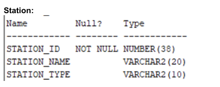

## Train Table
The `Train` table stores information about trains.

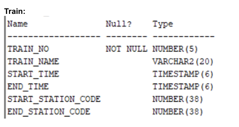

- **Foreign Keys**:
  - `start_station_code` references `Station(station_id)`
  - `end_station_code` references `Station(station_id)`

## Route Table
The `Route` table stores information about train routes.

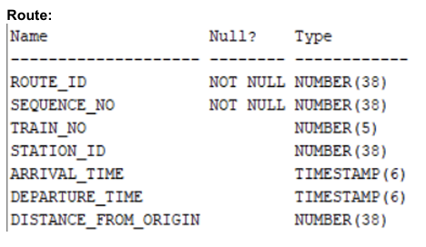

- **Primary Key**: `(route_id, sequence_no)`
- **Foreign Keys**:
  - `train_no` references `Train(train_no)`
  - `station_id` references `Station(station_id)`

## Class Table
The `Class` table stores information about the classes available on each train.

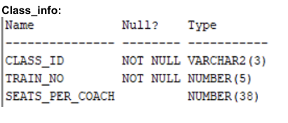

- **Primary Key**: `(class_id, train_no)`
- **Foreign Key**: `train_no` references `Train(train_no)`

## Train Fare Table
The `Train_fare` table stores fare details for different classes on each train.

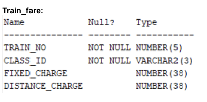

- **Primary Key**: `(train_no, class_id)`
- **Foreign Keys**:
  - `train_no` references `Train(train_no)`
  - `class_id` references `Class(class_id)`

## Coach Table
The `Coach` table stores information about the coaches on each train.

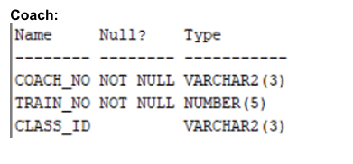

- **Primary Key**: `(coach_no, train_no)`
- **Foreign Keys**:
  - `train_no` references `Train(train_no)`
  - `class_id` references `Class(class_id)`

## Login Details Table
The `Login_details` table stores user login information.

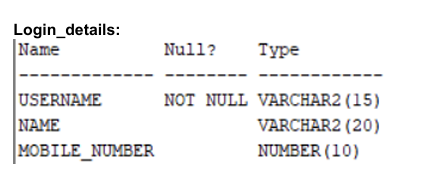

## Ticket Table
The `Ticket` table stores information about tickets booked by passengers.

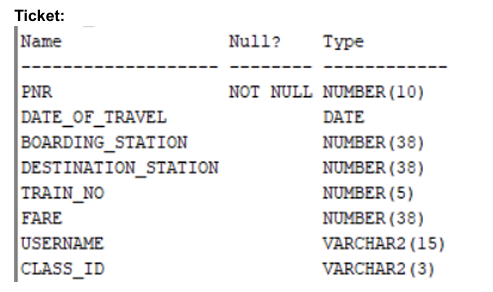

- **Foreign Keys**:
  - `boarding_station` references `Station(station_id)`
  - `destination_station` references `Station(station_id)`
  - `train_no` references `Train(train_no)`
  - `username` references `Login_details(username)`
  - `class_id` references `Class(class_id)`

## Payment Table
The `Payment` table stores information about payments made for tickets.

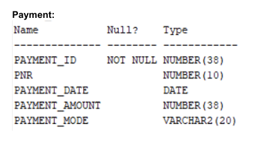

- **Foreign Key**: `pnr` references `Ticket(pnr)`

## Passenger Table
The `Passenger` table stores information about passengers associated with a PNR.

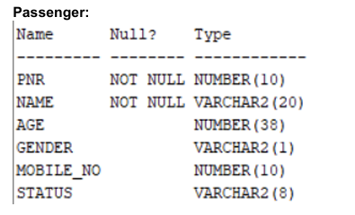

- **Primary Key**: `(pnr, name)`
- **Foreign Key**: `pnr` references `Ticket(pnr)`

## Waiting List Table
The `Inwaiting` table stores information about passengers on the waiting list.

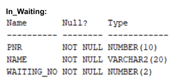

- **Primary Key**: `(pnr, waiting_no)`
- **Foreign Keys**:
  - `pnr` references `Passenger(pnr)`
  - `name` references `Passenger(name)`

## Booked Seat Table
The `Booked_seat` table stores information about booked seats on trains.

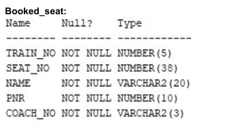

- **Primary Key**: `(train_no, seat_no, coach_no)`
- **Foreign Keys**:
  - `train_no` references `Train(train_no)`
  - `coach_no` references `Coach(coach_no)`
  - `pnr` references `Ticket(pnr)`
  - `name` references `Passenger(name)`